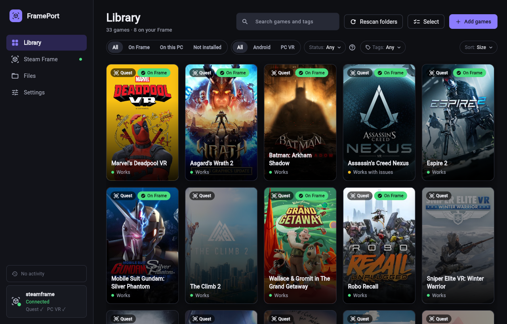
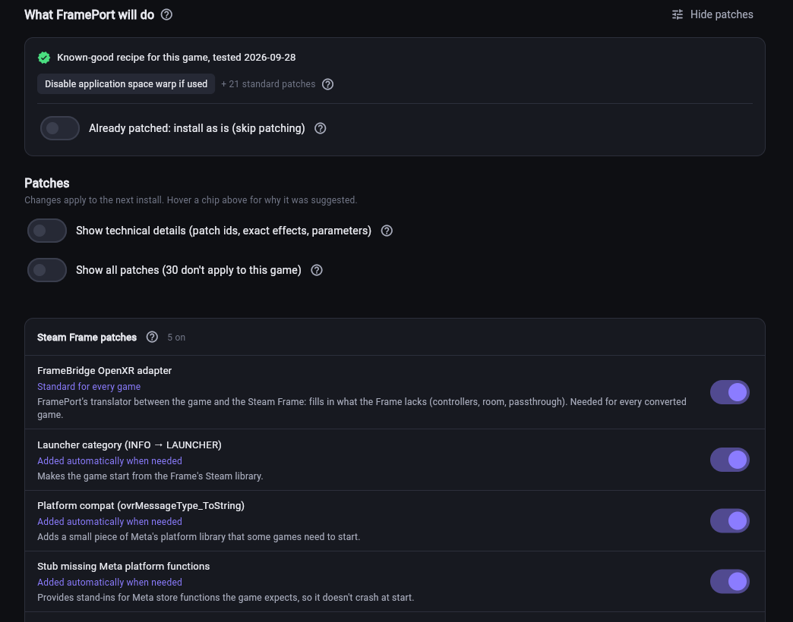
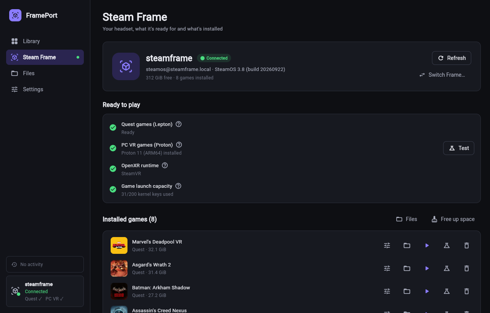
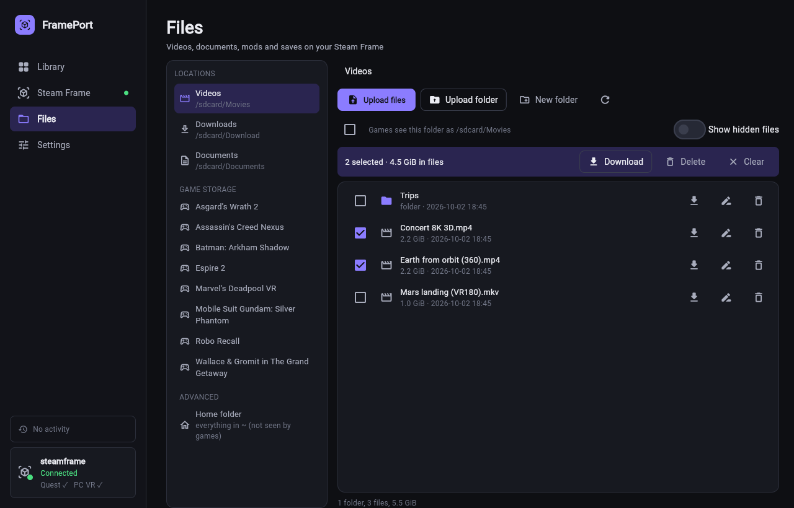

# FramePort

FramePort installs Meta Quest standalone games, other Android apps and PC VR games on the **Valve Steam Frame**. It
patches a game so it runs on the Frame's runtimes, copies it to the headset over Wi-Fi and adds it to the Frame's Steam
library with artwork.



## Purpose

FramePort is a **proof of concept**: it shows that VR software built for other platforms (Meta Quest, Oculus Rift) can
run on the Steam Frame with a translation layer and a few targeted fixes. Most of the work is done by the projects
FramePort wraps (see [Built on](#built-on)); FramePort selects and applies their fixes per game, adds Steam
Frame-specific patches, and handles installing, testing and launching.

FramePort is **not a piracy tool**. It does not download, share or unlock games, and it does not remove DRM, licence or
entitlement checks. Use it only with games you own. Games that check their licence through the Oculus Platform SDK are
marked as not runnable on the Frame.

## Getting started

1. **Download** the archive for your computer from the
   [latest release](https://github.com/spoopyghosty0/frameport/releases/latest) and extract it anywhere:

   | Computer | File | Start |
   |---|---|---|
   | Windows 10/11 (x64) | `FramePort-windows-x64.zip` | `FramePort.exe` |
   | macOS (Apple Silicon) | `FramePort-macos-arm64.zip` | `FramePort.app` |
   | Linux (x64) | `FramePort-linux-x64.tar.gz` | `FramePort/FramePort` |

   The builds are self-signed, so the first start shows a warning: Windows → **More info → Run anyway**;
   macOS → right-click the app → **Open**. Details: [docs/INSTALL.md](docs/INSTALL.md).
2. **Get the tools**: on first start FramePort downloads what it needs (Java runtime, OVRPort, apksigner) into its own
   folder. Nothing is installed system-wide.
3. **Connect the Frame**: turn on Developer Mode on the Frame (Settings → System → Developer). In FramePort open
   **Steam Frame**; if the Frame isn't listed, switch it to Desktop mode, open Konsole and paste the one command
   FramePort shows. This is needed once.
4. **Add games**: **Add games → Scan a folder** with your game backups: Android/Quest games (APK + OBB) or PC VR
   game folders.
   FramePort identifies each game and fetches its artwork and store details.
5. **Install**: open a game and click **Install on Frame**. FramePort patches, checks, uploads and adds the game to the
   Frame's Steam library, then runs a short launch test. Several installs queue up; if the Frame goes to sleep or
   drops off the Wi-Fi, the queue waits and continues where it stopped (FramePort keeps the Frame awake meanwhile).
   Your game files are never changed: the converted copy is temporary.
6. **Play**: put the headset on and start the game from the Steam library (or click **Play on Frame**).


Each game has **Game settings** in plain words (sharpness, refresh rate, controllers, menus, 360° video, mixed
reality), showing only what matters for that game. Changes are kept with the game and reach the Frame right away.


FramePort updates itself: when a new version is released, the Library shows **Update now**.

## What works

The built-in catalog has tested settings for 38 games (27 work, 5 work with known issues, 6 can't run on the Frame).
Other games get suggested patches from detection rules; each suggestion states its reason, and every patch can be
switched on or off under **Customize**: described in plain words, with **Show technical details** for the exact
effect of each patch.

Tried an untested game? Its page asks how it runs; **Share working config…** opens a prefilled GitHub issue so your
recipe can join the built-in catalog for everyone.



| Kind of app | On the Steam Frame |
|---|---|
| Meta Quest games (APK) | Translated to OpenXR (OVRPort) and patched for the Frame; run in Valve's Android runtime (Lepton) |
| Other Android VR apps using OpenXR (e.g. Pico builds) | Translated the same way; the other headset's own extensions and store services aren't available |
| Ordinary Android apps and games (no VR) | Installed unchanged and shown as a flat window in the headset |
| PC VR games (Windows; OpenXR, SteamVR or Oculus) | Run through Proton on the Frame (experimental), or on a Windows PC with SteamVR and streamed to the Frame; Oculus-only games use Revive |
| Can't run | 32-bit-only or x86-only APKs, Pico/HTC Wave SDK apps, Android XR apps, and games that check an Oculus licence (they need the Oculus app on a PC) |

Automated launch tests confirm that a game starts; visuals can only be checked in the headset.



The **Files** tab manages files on the Frame: upload videos, documents, mods or saves from the computer (buttons or
drag-and-drop), download, rename and delete (one entry or a selection), in the shared folders every game sees or in
one game's own storage.



## Built on

FramePort is a front end for other projects; most of the functionality comes from them:

| Project | Used for |
|---|---|
| [OVRPort](https://github.com/Android-XR-Bridge/OVRPort) (overport, originally [ovrport/app](https://github.com/ovrport/app)) | Converts Quest games to OpenXR: its CLI applies the game patches and supplies the OpenXR loader; FramePort also includes its VrApi→OpenXR adapter |
| Valve Lepton, Proton and SteamVR | Run Android games, Windows games and OpenXR on the Frame |
| [Revive](https://github.com/LibreVR/Revive) (LibreVR) | Runs Oculus Rift games on OpenXR / SteamVR |
| Mesa (Zink) | OpenGL ES on Vulkan on the Frame |
| [Khronos OpenXR SDK](https://github.com/KhronosGroup/OpenXR-SDK) | OpenXR headers for the native layers |
| Eclipse Temurin, Android apksigner, Android NDK | Java runtime, APK signing, building the native layers |
| [Flet](https://flet.dev) | The desktop app |
| OculusDB, Steam store | Game descriptions, genres and artwork |

FramePort's own parts: game detection and recipes, the Steam Frame OpenXR adapter (FrameBridge) and the other native
fixes in `native/`, the installer agent that runs on the Frame, and the desktop/command-line app.

## Command line

The same functions are available as `frameport` (included in the source tree; also released as a Python wheel):
`frameport scan`, `frameport build`, `frameport install`, `frameport test`, `frameport update`. Run
`frameport --help` for the full list.

## Documentation

- [docs/INSTALL.md](docs/INSTALL.md): installing, first launch, updating, Rift games, sending files, reporting problems.
- [docs/PLAYBOOK.md](docs/PLAYBOOK.md): symptoms and fixes per game.
- [docs/FRAME_RUNTIME.md](docs/FRAME_RUNTIME.md): Steam Frame runtime facts.
- [docs/ARCHITECTURE.md](docs/ARCHITECTURE.md): how the code is organised.
- [CONTRIBUTING.md](CONTRIBUTING.md): contributing code, recipes and translations.

## Development

```
uv sync --extra dev
uv run frameport-gui        # the app
uv run pytest               # tests
```

See `CLAUDE.md` for project notes and `native/README.md` for the native components.

## License

GPL-3.0-only (it includes GPL-3.0 code from OVRPort). Not affiliated with Valve or Meta.
