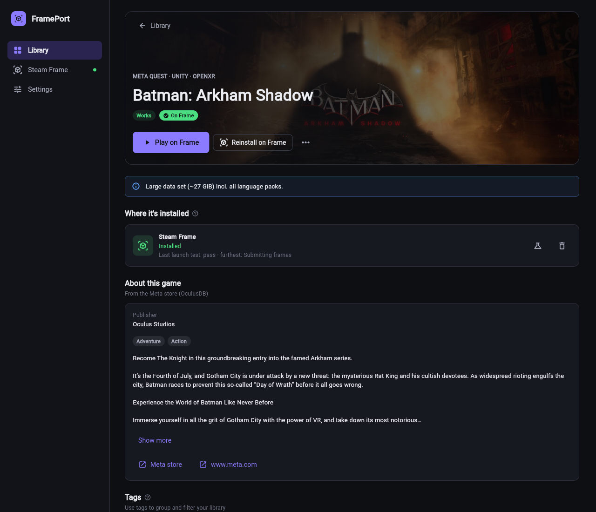
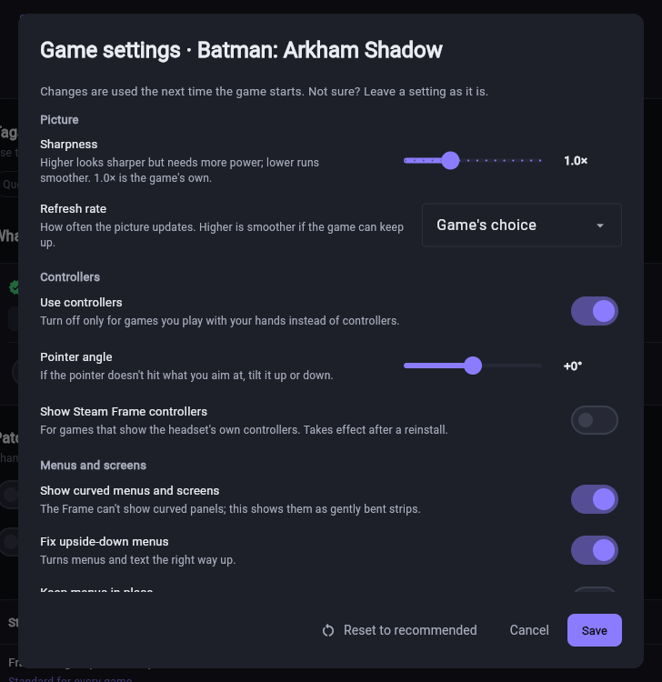

# Installing FramePort

Download the archive for your computer from the [latest release](https://github.com/spoopyghosty0/frameport/releases/latest)
and extract it anywhere. No installer or admin rights are needed. On first start FramePort downloads its Java
runtime, the OVRPort CLI and apksigner into its data folder (Settings → Tools shows them).

| Computer | Archive | Start |
|---|---|---|
| Windows 10/11 (x64) | `FramePort-windows-x64.zip` | `FramePort.exe` |
| macOS (Apple Silicon) | `FramePort-macos-arm64.zip` | `FramePort.app` |
| Linux (x64, GTK 3; Ubuntu 22.04 or newer) | `FramePort-linux-x64.tar.gz` | `FramePort/FramePort` |
| Command line only (Python 3.11+) | `frameport-<version>-py3-none-any.whl` | `frameport --help` |

The command-line version installs from the wheel's release link with `uv tool install <link>` (or pipx / pip).

## First launch

The builds are signed with a free self-signed certificate (Windows) and an ad-hoc signature (macOS), so the first
start shows a warning:

- **Windows:** "Windows protected your PC" → **More info** → **Run anyway**. Optional: import
  `FramePort-selfsigned.cer` (attached to each release) into *Trusted Root Certification Authorities* (Current User) to
  show FramePort as the publisher; the certificate can only sign code. Remove it with `certmgr.msc`.
- **macOS:** right-click `FramePort.app` → **Open** → **Open** (once), or `xattr -dr com.apple.quarantine FramePort.app`.
- **Linux:** `tar xzf FramePort-linux-x64.tar.gz && ./FramePort/FramePort`.

## Connecting the Steam Frame

The Frame and the computer must be on the same network.

1. In FramePort open **Steam Frame** and click **Show setup command**.
2. First time only, on the Frame:
   1. Press the **Steam button → Power → Switch to Desktop**.
   2. Open the app menu (bottom-left corner), search for **Konsole** and open it.
   3. Type the command FramePort shows exactly as shown (on-screen keyboard or any USB/Bluetooth keyboard) and press
      **Enter**. It looks like `curl -fsS 192.168.1.20:8765/1a2b3c4d | bash`: your computer's address, then a
      one-time code.
   4. After a few seconds the desktop closes by itself and the Frame returns to its normal view; that's expected. If
      Steam asks to install **Lepton** (Valve's Android runtime), confirm it.

   FramePort connects by itself within a minute. No password is needed. The command lets FramePort in and turns on
   **Developer Mode** (which includes SSH); everything it changes is listed in [FRAME_SETUP.md](FRAME_SETUP.md).
3. Later starts: a Frame in Developer Mode appears in the list and FramePort connects to it automatically. (If you
   turn Developer Mode off in Settings → System → Developer, turn it on again there.)

**Without Konsole:** turn on Developer Mode yourself (Settings → System → Developer). The Frame then appears under
**On your network**. On the Frame open Settings → Developer → **Pair new host**, then click **Connect** in FramePort
and approve it on the Frame (Valve's own devkit pairing; it only sends this computer's key to the Frame). Install
Lepton from the Steam Frame page afterwards if it's missing.

### Firewalls

If the setup command only says "timed out", a firewall on your computer blocks the Frame; the setup page
says which after about 45 seconds. Details per system: [FRAME_SETUP.md](FRAME_SETUP.md#network-and-firewalls).

## Installing games

- **Install on Frame** on a game's page (or select several in the Library and install them together). Installs run
  one after another in the background; **Activity** shows the current one at the top.
- **Update all** reinstalls every game whose build changed (e.g. after a FramePort update). Questions that need an
  answer (e.g. Oculus games that can't run on the Frame) are asked once, for all games.
- If the Frame goes to sleep, turns off or leaves the Wi-Fi, the queue **waits** and continues once it's back; uploads
  pick up where they stopped. While installs run, FramePort keeps the Frame from going to sleep. Before a large batch
  it checks the Frame has enough free space.
- Your own game files are never changed. The converted copy is temporary: it's removed once the game is on the Frame
  (Settings → Installing: keep them, or remove all now).
- **Game settings…** (game menu or the Steam Frame page): sharpness, refresh rate, controllers, menus, 360° video and
  mixed-reality options in plain words, only those that matter for the game. Changes are kept with the game and,
  when it's installed, used the next time it starts.
- Ordinary Android apps (no VR) are installed unchanged and shown as a flat window in the headset. Android's
  back/home/recents buttons are hidden by default (patch **Hide Android's navigation bar**).

Each game has **Game settings** in plain words (sharpness, refresh rate, controllers, menus, 360° video, mixed
reality), showing only what matters for that game. Changes are kept with the game and reach the Frame right away.

## Updating

FramePort checks for a new release at start and every 6 hours (it only downloads the release information). When one
exists, the Library shows **Update now**: FramePort downloads the new version, verifies it against the release's
`SHA256SUMS.txt` (on Windows also the signature), restarts and opens as the new version. Games, settings, signing keys
and the Frame connection are kept. Running installs finish first. **Later** skips that version.

Settings → **Updates**: turn the check off, or turn on **Install updates automatically** (downloads in the background,
installs at the next start). If FramePort's folder isn't writable, **Update now** opens the release page instead. The
update log is `logs/update.log` in the data folder.

Command line: `frameport update` (`--check` only checks, exit code 10 = update available; `--yes` doesn't ask).
`FRAMEPORT_NO_UPDATE_CHECK=1` turns all checks off.

## PC VR games

PC VR games are Windows VR games (OpenXR, SteamVR or Oculus). Scan a folder of them (one folder per game) or use
**Add games → Add one game folder…**. FramePort finds the game's program and asks when there is more than one
candidate. **Already patched** on a game page installs a copy unchanged. Oculus-only games need Revive: FramePort uses
an installed Revive, or downloads a portable copy.

- **Play from this PC:** Windows with Steam and SteamVR. **Install on this PC** adds the game to Steam; stream it to the
  Frame with Steam Link. If a game can't keep up with the refresh rate, FramePort lowers the rate and enables motion
  smoothing in SteamVR's per-game settings the next time you press Play.
- **Play on the Frame (experimental):** Steam Frame → *PC VR games (Proton)* → **Install**, then **Install on Frame**
  on the game page.
- Games that use the Oculus Platform SDK check the licence through the Oculus app, so they run on the PC only.

## Files on the Frame (videos, documents, mods, saves)

The **Files** tab manages files on the Frame over the same connection as installs; no other transfer app is needed.
Pick a location, browse folders, and use **Upload files** / **Upload folder**, **New folder**, or the download, rename
and delete buttons on each entry. Tick several entries (or the box above the list for all) to download or delete them
together. In the downloaded app you can also drag files and folders from Explorer / Finder / your file manager onto
the list to upload them into the open folder. Uploads and downloads run in the Activity panel, resume after an interruption and
skip files that are already there.

- **Videos**, **Downloads** and **Documents** appear inside every Quest game as `/sdcard/Movies`, `/sdcard/Download`
  and `/sdcard/Documents`. Apps find files by browsing folders; Android's media index doesn't work on the Frame.
- Under **Game storage**, each installed game has its own `/sdcard` (mods, saves). A game's menu → **Add videos and
  files…** opens it. Video players that list only their own folder (e.g. 4XVR's "Internal Storage" = `4XPlayer`) find
  videos uploaded into that folder.
- **Home folder** shows everything in the Frame's home folder (hidden files with **Show hidden files**).

Command line: `frameport frame send <files> --dest videos` (`frameport frame storage` lists the destinations).

## Sharing a working game, reporting a problem

- **Share working config…** (game menu): opens a prefilled GitHub issue with the game's patches and settings. Accepted
  configs become built-in recipes. Untested games ask on their page once they've been installed or tested: **It
  works**, **It has issues** or **It doesn't run**.
- **Report a problem…** (game menu, or Settings → Problems and feedback): saves a diagnostics zip to Documents (logs,
  recipe, device details; IP addresses, user names, home folders and Steam ids replaced) and opens a prefilled GitHub
  issue to attach it to. Command line: `frameport diag report <game>`, `frameport share-recipe <game>`.

## Command line

Everything the app does is also a `frameport` command (in a source checkout: `uv run frameport`); `frameport --help`
and `frameport <command> --help` describe every option. The main ones:

| Command | What it does |
|---|---|
| `scan <folder>` / `list` / `show <game>` | add games, list the library, show a game's analysis and patches |
| `recipe <game> --enable/--disable <patch>` | change a game's patches (`patches` lists them all) |
| `build <game>` / `install <game>` / `test <game>` | build, install on the Frame (`--to pc` for PC VR on this PC), launch test |
| `frame discover` / `frame connect` / `frame info` | find, pair with and describe the Frame |
| `frame send` / `frame storage` / `frame cleanup` | copy files to the Frame, show where they go, free space |
| `tools status` / `tools install` | the tools FramePort downloads |
| `diag report <game>` / `share-recipe <game>` | report a problem / share a working recipe |
| `update` | update FramePort |

Exit codes: 0 done, 1 something failed, 2 wrong usage, 10 (`update --check`) a newer version exists. Errors are
one line on stderr; `FRAMEPORT_DEBUG=1` shows the full traceback.

## Uninstalling

Settings → **Uninstall FramePort…** (or `frameport uninstall-app`) removes its data folder, the Steam shortcuts it
added on this computer and, optionally, its games on the Frame (saves can be kept). It first saves your signing keys
to Documents: game updates must be signed with the same key. Then delete the program folder.

## Verify a download

Each archive has a GitHub build attestation:
`gh attestation verify FramePort-windows-x64.zip -R spoopyghosty0/frameport`. `SHA256SUMS.txt` lists the checksums
(`sha256sum -c SHA256SUMS.txt`). Windows certificate SHA-256 fingerprint:
`4E:12:98:91:62:C0:E4:50:FB:65:1D:34:BB:73:00:09:7B:78:BE:88:5C:A7:6C:42:23:46:9B:92:A1:59:A7:6E`.
